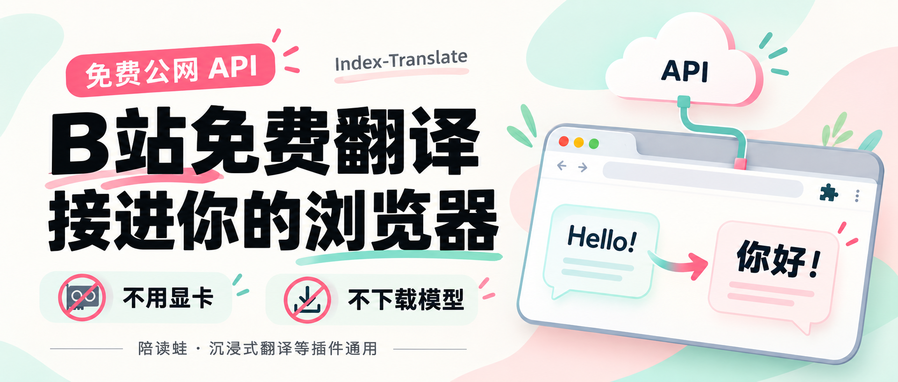

# Index-Translate 浏览器接入指南

使用 Bilibili 的免费公网翻译 API，接入陪读蛙、沉浸式翻译等支持 OpenAI 兼容接口的浏览器插件。不用本地 GPU，不下载模型权重；电脑只运行官方的小型转发脚本，翻译仍需联网。

[完整教程](docs/tutorial.md) · [Windows 自启模板](scripts/start_proxy.vbs) · [更新记录](CHANGELOG.md)



## 插件参数速查

| 配置项 | 填写内容 |
| --- | --- |
| Base URL | `http://127.0.0.1:8080/v1` |
| API Key | `index` |
| Model | `Index-Translate-35B-A3B` |

如果插件明确要求完整的 API URL，例如沉浸式翻译部分界面中的“自定义 URL 地址”，填 `http://127.0.0.1:8080/v1/chat/completions`。`index` 是占位值；当前官方代理不需要购买或申请 OpenAI 密钥。

## Windows 常用命令

先将 [官方 call_api.py](https://github.com/bilibili/Index-Translate/blob/main/inference/llm/call_api.py) 下载到 `D:\IndexTranslate\call_api.py`，然后在 PowerShell 执行。没有 D 盘可以改用 `C:\IndexTranslate`，并同步替换所有对应路径。

### 检查 Python

```powershell
py --version
```

Windows 的 `python` 可能指向 Microsoft Store 的应用执行别名，优先试 `py`。若没有可用的 Python，到 [Python 官网](https://www.python.org/downloads/windows/) 安装 Python 3，再重新打开 PowerShell 检查。

### 直接测试公网翻译

```powershell
py "D:\IndexTranslate\call_api.py" "Hello, world!" --target zh --model Index-Translate-35B-A3B
```

返回中文译文才说明公网调用成功。直连插件出现 412 不代表 API 已经不可用，可先用这条命令排查，再试官方本地代理。

### 启动本地代理

```powershell
py "D:\IndexTranslate\call_api.py" --serve
```

手动启动时保留窗口。不要同时启动多个实例，否则会争用 8080 端口。

### 确认代理已启动

```powershell
curl.exe http://127.0.0.1:8080/v1/models
```

这里的模型列表是脚本预设内容，只能证明本地代理响应正常，不能证明云端模型当前可用。还要在插件中实际翻译一段网页。

### 查出 Python 的真实路径

```powershell
py -c "import sys; print(sys.executable)"
```

复制输出的完整路径，替换 [start_proxy.vbs](scripts/start_proxy.vbs) 中的 `pythonPath`，再将模板保存为 `D:\IndexTranslate\start_proxy.vbs`。其他示例路径也要与本机目录一致。

在任务计划程序创建 `Index Translate Proxy`，使用当前用户、选择“只在用户登录时运行”，触发器为当前用户“登录时”，操作填写：

| 字段 | 内容 |
| --- | --- |
| 程序或脚本 | `C:\Windows\System32\wscript.exe` |
| 添加参数 | `"D:\IndexTranslate\start_proxy.vbs"` |
| 起始于 | `D:\IndexTranslate` |

先用 Ctrl+C 停止手动实例，再测试任务。重启并登录后不手动启动脚本，先验证 `/v1/models`，再实际翻译网页。完整操作见 [自动静默启动](docs/tutorial.md#step-4)。

### 停止当前代理

手动启动的实例，在原窗口按 Ctrl+C。静默启动的实例，先查 8080 端口：

```powershell
netstat -ano | findstr :8080
```

找到本地地址 `127.0.0.1:8080`、状态 `LISTENING` 那一行最右侧的 PID。假设是 `12345`，查清它的命令行确实指向 `call_api.py --serve`，再停止：

```powershell
Get-CimInstance Win32_Process -Filter "ProcessId = 12345" | Select-Object Name,CommandLine
taskkill /PID 12345 /F
```

将 `12345` 换成实际 PID。若不是这个代理，不要结束它。

临时停用时，先在任务计划程序中禁用 `Index Translate Proxy`，再停止当前代理。彻底不再使用时，依次清理插件配置、自启任务、相关进程、额外自启入口和本地文件，最后重启核验。删除任务不会中断已启动的 Python；只检查 8080 也可能漏掉未正常监听的实例。详细查询命令、文件清单及完成标准见 [第 12 节：停止与彻底清理](docs/tutorial.md#cleanup)。

## 完整教程目录

- [一、交给 AI，或自己跟做](docs/tutorial.md#step-1)
- [二、确认免费公网 API 能用](docs/tutorial.md#step-2)
- [三、接入浏览器插件](docs/tutorial.md#step-3)
- [四、登录 Windows 后自动静默启动](docs/tutorial.md#step-4)
- [五、停止方法、彩蛋及 Mac 补充](docs/tutorial.md#step-5)

## 更新与来源

完整教程基于 Windows 成功配置经历，官方说明核对日期为 **2026-10-07**。正文使用官方明确宣传的 `Index-Translate-35B-A3B`；2B / 9B 只作为当时实测的补充发现，未来可用性以官方 README 和实际调用为准。

- [Bilibili 官方仓库与最新 README](https://github.com/bilibili/Index-Translate)
- [官方 call_api.py 原始文件](https://raw.githubusercontent.com/bilibili/Index-Translate/main/inference/llm/call_api.py)
- [陪读蛙：OpenAI 兼容服务商](https://www.readfrog.app/zh/docs/providers/openai-compatible-providers)
- [沉浸式翻译：其他 AI 模型接入](https://immersivetranslate.com/zh-Hans/docs/services/ai/)

此仓库保存个人教程及启动模板，官方脚本通过上面的链接获取，不在仓库中维护副本。无需安装 vLLM。官方“免费”政策及插件界面可能调整，以各自的最新说明为准。

更新时先修改完整教程；涉及命令或参数变化时同步更新此页和自启模板，并在 [CHANGELOG.md](CHANGELOG.md) 中记录日期、变动及核对情况。
